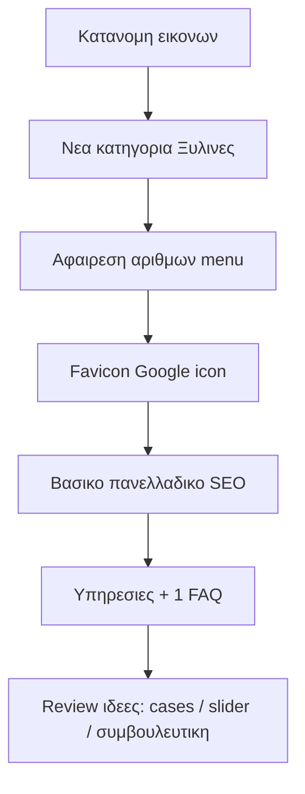

# Backlog αύριο — συζήτηση & προτεραιότητες

Καμία αλλαγή κώδικα σήμερα. Παρακάτω είναι η λίστα σου ταξινομημένη σε **Must / Nice / Later**, με σύντομη γνώμη και τι σημαίνει τεχνικά στο project.

---

## Must (κάνουν το site πιο “σωστό” αύριο)

### 1) Νέα κατηγορία «Ξύλινες κατασκευές» + εικόνες
**Ναι — ξεκίνα από εδώ.** Το σύστημα κατηγοριών είναι ήδη έτοιμο: [`src/data/gallery/categories.ts`](src/data/gallery/categories.ts), modules ανά κατηγορία, pages `/projects/[category]`.

Τι χρειάζεται: νέο slug (π.χ. `xylines-kataskeyes`), νέο type στο `GalleryCategory`, νέο data file, cover image, και μετακίνηση έργων που σήμερα κάθονται λάθος σε «Έπιπλα» / άλλες.

**Συζήτηση:** Όρισε αύριο 1 πρόταση τι μπαίνει μέσα (π.χ. επενδύσεις, διαχωριστικά, οροφές, custom ξυλεία) ώστε να μην επικαλύπτει τα «Έπιπλα».

### 2) Σωστή κατανομή / διαχωρισμός εικόνων
**Ναι — μαζί με το #1.** Χωρίς αυτό, η νέα κατηγορία μένει άδεια ή διπλοκατηγοριοποιημένη.

Πρακτικά: audit των `cover` + `images[]` σε `kouzina` / `ntoulapa` / `porta` / `pergola` / `epipla` και μετακίνηση στα σωστά modules. Όχι redesign — καθαρό content ops.

### 6) Να βγουν οι αριθμοί από το hamburger
**Γρήγορο win, κάν’ το νωρίς.** Στο mobile menu ([`src/components/layout/Navbar.tsx`](src/components/layout/Navbar.tsx) ~γραμμές 193–198) εμφανίζονται `01`, `02`, `03`, `04` δίπλα στα links. Αυτά εννοείς ως «αριθμούς» — όχι counts έργων.

Αν εννοείς τα `Χ έργα · Υ φωτογραφίες` στις κάρτες κατηγορίας ([`CategoryCards.tsx`](src/components/gallery/CategoryCards.tsx)), πες το — είναι ξεχωριστή απόφαση (εκεί βοηθούν στο trust, στο menu είναι διακοσμητικά).

### 5) Πανελλαδικό SEO
**Ναι, αλλά σε στρώσεις — όχι “όλο το SEO” σε μία μέρα.**

Τώρα υπάρχει βασικό metadata στο [`layout.tsx`](src/app/layout.tsx) + σελίδες, και ήδη copy «πανελλαδικά» σε Hero/Contact. Κενά: keywords/titles πιο τοπικά-πανελλαδικά στα ελληνικά, meta ανά κατηγορία, schema LocalBusiness/Service, alt κειμένα, ίσως σελίδα/παράγραφοι πόλεων χωρίς spam.

**Αύριο realistic scope:** titles/descriptions + keywords + επιβεβαίωση sitemap/robots + 1–2 φράσεις πανελλαδικής κάλυψης σε Υπηρεσίες/Έργα. Βαθύτερο SEO = επόμενη μέρα.

### 9) Icon στην αναζήτηση Google (favicon)
**Ναι — μικρό αλλά ορατό.** Δεν φαίνεται `app/icon` / `favicon` στο App Router. Χρειάζεται `src/app/icon.png` (+ `apple-icon.png`) από το logo. Το Google μπορεί να αργήσει να το ενημερώσει· το browser tab αλλάζει αμέσως.

---

## Nice (αξίζει αν μείνει χρόνος)

### 3) Προσθήκη / επεξεργασία άλλων εικόνων
**Ναι, αλλά μετά από #1–#2.** Αλλιώς θα ξανακατηγοριοποιείς. Crop, φως, WebP, thumbs με το υπάρχον pipeline (`generate-gallery-thumbs`).

### 10) Άλλη ερώτηση στο FAQ
**Ναι — 1 καλή ερώτηση αρκεί.** Τώρα 3 items στο [`src/data/faq.ts`](src/data/faq.ts). Ιδέες που πουλάνε: χρόνος παράδοσης, περιοχή κάλυψης / πανελλαδικά, κόστος μελέτης, υλικά/εγγύηση.

### 13) Να γεμίσει λίγο το Υπηρεσίες
**Ναι — ψηλά στο Nice.** Το [`src/data/services.ts`](src/data/services.ts) έχει μόνο 3 υπηρεσίες με κοντά κείμενα. Πρόσθεσε 1–2 (π.χ. Συμβουλευτική, Μελέτη/3D, Ξύλινες κατασκευές) και 2–3 προτάσεις ανά υπηρεσία — όχι νέα σελίδα ακόμα.

### 8) Comparison slider και αλλού
**Μόνο αν έχεις 1–2 πραγματικά before/after.** Το component υπάρχει ([`ComparisonSlider.tsx`](src/components/ui/ComparisonSlider.tsx)) και χρησιμοποιείται στο [`BeforeAfterCta`](src/components/sections/BeforeAfterCta.tsx). Χωρίς καλό ζεύγος εικόνων φαίνεται κενό. Ιδέα: 1 ακόμα στην αρχική ή μέσα σε συγκεκριμένο case — όχι παντού.

### 4) Αξιολόγηση και ιδέες
**Κράτα το ως review pass στο τέλος της ημέρας** (10–15'): τι φαίνεται thin, τι μπερδεύει, τι λείπει για πελάτη που δεν σε ξέρει. Όχι ξεχωριστό feature.

---

## Later / ιδέες (μην τα ανοίξεις όλα αύριο)

### 7) Case studies για κάποια projects
**Καλή ιδέα μακροπρόθεσμα**, όχι αύριο ολόκληρο σύστημα. Πρώτα σκέψου format: 3–5 επιλεγμένα έργα με πρόβλημα → λύση → υλικά → 4–6 φωτό. Αν ταιριάζει στο brand (premium custom), ναι. Αν δεν έχεις κείμενα/φωτό “πριν”, κράτα lightbox gallery.

### 11) Συμβουλευτική
**Ταιριάζει ως υπηρεσία ή FAQ/CTA**, όχι απαραίτητα νέα σελίδα. Φυσική σύνδεση με επικοινωνία («δωρεάν πρώτη εκτίμηση» / «συμβουλευτική επίσκεψη»).

### 12) Κάτι για παραγγελία
**Πρόσεξε.** «Παραγγελία» online για custom έπιπλα σπάνια δουλεύει χωρίς τιμές/configurator. Καλύτερο: ισχυρότερο CTA («Ζητήστε προσφορά», «Κλείστε ραντεβού») ή μικρό lead form πεδίο «Τύπος έργου». E-commerce = overkill τώρα.

---

## Προτεινόμενη σειρά για αύριο (μισή–μία μέρα)

1. Κατανομή εικόνων  
2. Νέα κατηγορία + covers  
3. Αριθμοί hamburger  
4. Favicon  
5. SEO pass (titles/descriptions/πανελλαδικά)  
6. Υπηρεσίες λίγο γέμισμα + 1 FAQ  
7. Στο τέλος: αποφάσεις για cases / extra slider / συμβουλευτική-παραγγελία

---

## Τι να αποφασίσουμε πριν ξεκινήσεις αύριο

- Τι ακριβώς μπαίνει σε «Ξύλινες κατασκευές» vs «Έπιπλα».  
- Οι αριθμοί στο hamburger είναι τα `01–04` στο menu (πιθανότερο) ή τα counts στις κάρτες κατηγοριών.  
- Αν έχεις έτοιμες φωτό before/after για δεύτερο comparison — αλλιώς το #8 μένει ιδέα.
